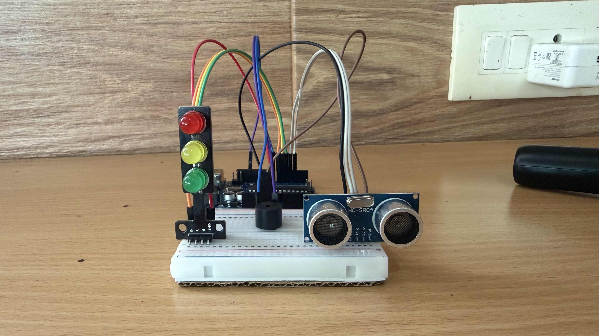
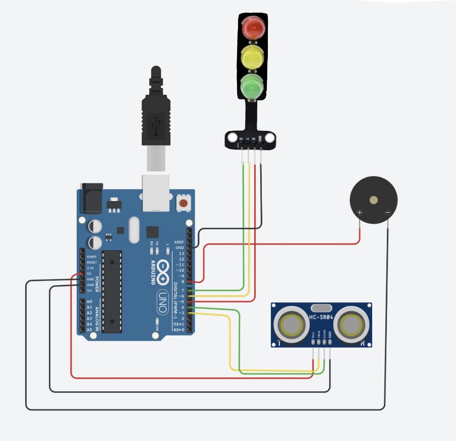

# 🚗 Smart Parking Assistant

An Arduino-based parking assistant system that detects nearby obstacles using an ultrasonic sensor and provides visual and audible warnings to assist drivers while parking.

<p align="center">
  
</p>

---

## 📑 Table of Contents

- [Project Overview](#project-overview)
- [Features](#features)
- [Components Required](#components-required)
- [Working Principle](#working-principle)
- [Distance Thresholds](#distance-thresholds)
- [Circuit Connections](#circuit-connections)
- [Circuit Diagram](#circuit-diagram)
- [Source Code](#source-code)
- [Technologies Used](#technologies-used)
- [Demonstration](#demonstration)
- [Applications](#applications)
- [Future Improvements](#future-improvements)
- [Author](#author)
- [License](#license)
- [Acknowledgements](#acknowledgements)

---

## Project Overview

The **Smart Parking Assistant** is an Arduino Uno-based embedded systems project developed individually for an online competition.

The system is designed to assist drivers while parking by detecting nearby obstacles using an HC-SR04 ultrasonic sensor. Based on the measured distance, the Arduino Uno controls a traffic light module and an active buzzer to provide clear visual and audible warnings, helping reduce the risk of minor collisions during parking.

This project provided hands-on experience in Arduino programming, sensor interfacing, embedded systems, and hardware implementation.

---

## Features

- Real-time obstacle detection
- Distance measurement using the HC-SR04 ultrasonic sensor
- Three-level parking indication
- Visual warning using a traffic light module
- Audible warning using an active buzzer
- Live distance monitoring through the Arduino Serial Monitor
- Simple, reliable, and low-cost design

---

## Components Required

| Component | Quantity |
|-----------|:--------:|
| Arduino Uno | 1 |
| HC-SR04 Ultrasonic Sensor | 1 |
| Traffic Light Module | 1 |
| Active Buzzer | 1 |
| Breadboard | 1 |
| Jumper Wires | As Required |
| USB Cable | 1 |

---

## Working Principle

The Smart Parking Assistant continuously measures the distance between the ultrasonic sensor and the nearest obstacle.

The Arduino Uno processes the measured distance and classifies it into three safety zones.

### 🟢 Safe Zone (>15 cm)

- Green LED turns ON.
- Buzzer remains OFF.
- Indicates that the vehicle is at a safe distance.

### 🟡 Caution Zone (8–15 cm)

- Yellow LED turns ON.
- Buzzer produces slow intermittent beeps.
- Alerts the driver to slow down.

### 🔴 Danger Zone (<8 cm)

- Red LED turns ON.
- Buzzer produces rapid intermittent beeps.
- Warns the driver to stop immediately.

---

## Distance Thresholds

| Distance | LED Status | Buzzer |
|-----------|------------|---------|
| >15 cm | 🟢 Green | OFF |
| 8–15 cm | 🟡 Yellow | Slow Beeps |
| <8 cm | 🔴 Red | Fast Beeps |

---

## Circuit Connections

| Component | Arduino Pin |
|-----------|-------------|
| HC-SR04 VCC | 5V |
| HC-SR04 GND | GND |
| HC-SR04 Trig | D3 |
| HC-SR04 Echo | D4 |
| Green LED | D7 |
| Yellow LED | D6 |
| Red LED | D5 |
| Active Buzzer (+) | D8 |
| Active Buzzer (-) | GND |

---

## Circuit Diagram

The circuit was designed and tested before hardware implementation.

<p align="center">
  
</p>

---

## Source Code

The Arduino program performs the following tasks:

- Generates ultrasonic trigger pulses.
- Measures the echo time from the HC-SR04 sensor.
- Calculates the obstacle distance.
- Controls the traffic light module based on the measured distance.
- Produces different buzzer patterns for caution and danger zones.
- Displays the measured distance on the Arduino Serial Monitor.

The complete Arduino source code is available in this repository.

---

## Technologies Used

- Arduino Uno
- Arduino IDE
- Embedded C (Arduino Programming)
- HC-SR04 Ultrasonic Sensor
- Traffic Light Module
- Active Buzzer

---

## Demonstration

🎥 **Project Demonstration**

https://youtu.be/38rVuBSjiCw?feature=shared

The demonstration includes:

- Obstacle detection
- LED indication
- Buzzer alerts
- Complete working of the Smart Parking Assistant

---

## Applications

- Parking assistance for vehicles
- Reverse parking safety
- Obstacle detection systems
- Arduino and embedded systems learning
- Electronics laboratory demonstrations

---

## Future Improvements

Some possible improvements include:

- Displaying the measured distance on an LCD or OLED display.
- Developing a battery-powered portable version.
- Adding Bluetooth or Wi-Fi connectivity.
- Using multiple ultrasonic sensors for wider obstacle detection.
- Providing voice-based parking alerts.
- Designing a waterproof enclosure for outdoor applications.

---

## Repository Contents

```text
Smart-Parking-Assistant/
│
├── README.md
├── Code
├── IMG_0160.jpeg
├── IMG_1639.jpeg
└── LICENSE
```

---

## Author

### Pragathi Muthuvel

**B.Tech – Electronics and Communication Engineering**  
**Specialization:** Semiconductor and VLSI Design

This project was developed individually as part of an online competition to strengthen my practical knowledge of Arduino programming, embedded systems, and sensor interfacing.

---

## License

This project is licensed under the MIT License.

---

## Acknowledgements

I would like to thank the Arduino community and Tinkercad for providing valuable resources that supported the development of this project.

I also appreciate everyone who encouraged and supported me throughout this project.

---

⭐ Thank you for visiting this repository.